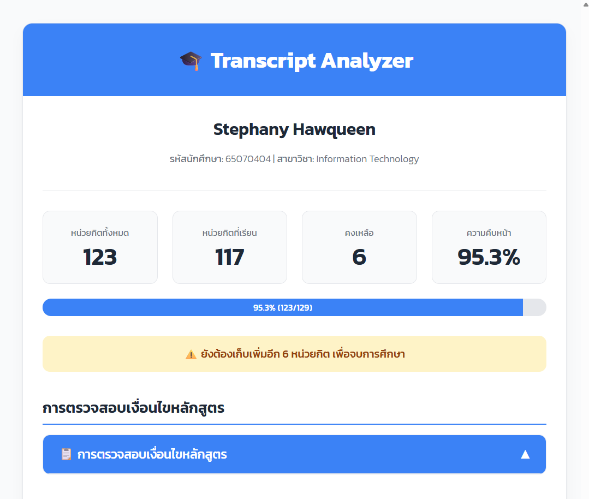

# 📊 KMITL IT Curriculum Checker

สคริปต์ตรวจสอบความคืบหน้าการเรียนตามหลักสูตรเทคโนโลยีสารสนเทศ สถาบันเทคโนโลยีพระจอมเกล้าเจ้าคุณทหารลาดกระบัง (หลักสูตรปรับปรุง พ.ศ. 2560)

## 🌐 Demo

**เข้าใช้งานได้ที่:** [https://pooh303.github.io/kmitl-it-curriculum-checker/](https://pooh303.github.io/kmitl-it-curriculum-checker/)


## ✨ คุณสมบัติหลัก

- **📊 Dashboard สรุปภาพรวม:** แสดงผลหน่วยกิตรวม, หน่วยกิตที่เหลือ, และความคืบหน้าในการเรียนเป็นเปอร์เซ็นต์
- **✅ ตรวจสอบเงื่อนไขการจบหลักสูตร:** วิเคราะห์และแสดงผลการเรียนตามโครงสร้างหลักสูตรอย่างละเอียด
- **🧠 ตรวจจับสายวิชาอัตโนมัติ:** สามารถตรวจสอบได้ว่าคุณเรียนวิชาในสายใดเป็นหลัก และใช้เป็นเกณฑ์ในการคำนวณ
- **🤝 รองรับเงื่อนไขสหกิจศึกษา:** หากคุณเรียนสหกิจศึกษา สคริปต์จะปรับลดหน่วยกิตวิชาเลือก IT ให้ตามเงื่อนไข
- **📅 แสดงผลแยกตามปีการศึกษา:** จัดกลุ่มรายวิชาตามปีการศึกษาและเทอม สามารถคลิกเพื่อย่อ/ขยายดูรายละเอียดได้
- **🎨 หน้าตาสวยงามและโต้ตอบได้:** ออกแบบมาให้อ่านง่าย สบายตา และใช้งานสะดวกกว่าหน้าเว็บต้นฉบับ


## ⚠️ ข้อควรทราบ

- **🚫 Pop-up Blocker:** สคริปต์นี้จะเปิดผลลัพธ์ในหน้าต่างใหม่ กรุณา**อนุญาตการแสดง Pop-up** จากเว็บไซต์ `reg.kmitl.ac.th` ในเบราว์เซอร์ของคุณ
- **📚 ความถูกต้องของหลักสูตร:** สคริปต์นี้ออกแบบมาสำหรับ**หลักสูตรเทคโนโลยีสารสนเทศ (หลักสูตรปรับปรุง พ.ศ. 2560)** ของสถาบันเทคโนโลยีพระจอมเกล้าเจ้าคุณทหารลาดกระบัง หากมีการเปลี่ยนแปลงโครงสร้างหลักสูตร อาจต้องมีการอัปเดตโค้ดในอนาคต

## 📂 โครงสร้างโปรเจกต์
```
kmitl-it-curriculum-checker/
├── index.html              # หน้าเว็บคู่มือการใช้งาน
├── code.js                 # สคริปต์ตรวจสอบหลักสูตร
├── assets/
│   └── favicon.png         # ไอคอนเว็บ
│   └── images/             # ภาพหน้าจอประกอบคู่มือ
│       ├── step1-login.png
│       ├── step2-navigate.png
│       ├── step3-console.png
│       ├── step4-paste.png
│       └── screenshot.png
├── Transcript-Checker.js   # สคริปต์เวอร์ชั่นสำหรับพัฒนา
└── README.md
```

## 🛠️ เทคโนโลยีที่ใช้

- **HTML5** - โครงสร้างหน้าเว็บ
- **CSS3** - การออกแบบและ responsive design
- **JavaScript** - สคริปต์วิเคราะห์ข้อมูล
- **Google Fonts (Kanit)** - ฟอนต์ภาษาไทย


## 👥 ผู้พัฒนา

- **[Pooh303 - https://github.com/pooh303](https://github.com/pooh303)**

## 🙏 Acknowledgments

- เนื่องจากเป็นการ Vibe Coding ถ้าหากว่ามีข้อผิดพลาดหรือพบเจอปัญหาประการใด อย่าลังเลที่จะแจ้งให้เราทราบ ขอบคุณครับ 😉

---